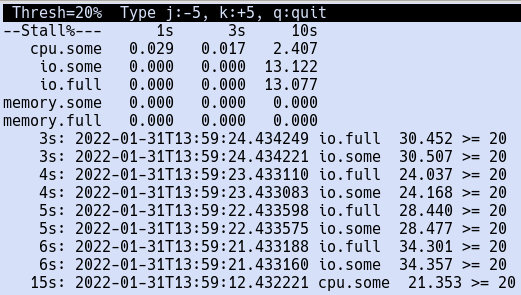

# Linux Pressure Stall Information (PSI) Status App
`psistat` is a simple python3 program to display the PSIs and to capture/display exception events.

`psistat` might be found helpful when encountering unexplained delays and you wish to identify down the general cause.

## Installation
Download the `psistat` program, make it excutable, and put in on your execution path.
For example, this might suffice for your install:
```
    git clone git@github.com:joedefen/psistat.git
    chmod +x psistat/psistat
    cp psistat/psistat ~/.local/bin/.
    rm -rf psistat
```

## Instruction for Use
Typically, simply run `psistat`.  Its window looks like:



`psistat` displays:
* On the top portion of the screen,  the 1s, 3s, and 10s running averages
  for each of the PSI stats.
* Below the stats is a list of exception events beginning with the most recent;
  each event includes:
  * The relative time and absolution time of the event.
  * The the type of event.
  * The pressure value as a percentage relative to the current threshold.


When `psistat` is running, entering these keys has special effect:
* `j` - lower the threshold for exception events by 5% (but to no lower than 5%)
* `k` - raise the threshold for exception events by 5% (but to no higher than 95%)
* `q` - quit the program.


`psistat` has only a few options:
```
usage: psistat [-h] [-D] [-t THRESHOLD_PCT]

optional arguments:
  -h, --help            show this help message and exit
  -D, --debug           debug mode w/o Window
  -t THRESHOLD_PCT, --threshold-pct THRESHOLD_PCT
                        event threshold pct [min=5, max=95, dflt=20]
```

## Load Test
To create some test loads, you can use the `create_load.c` program found at
[psi-by-example](https://github.com/shuveb/psi-by-example).

